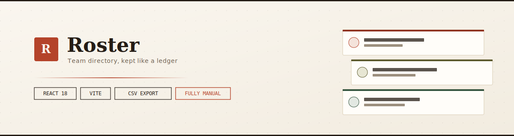
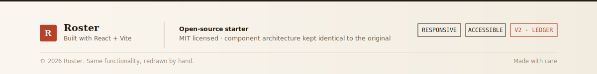

<p align="center">
  
</p>

<p align="center">
  
  
  
  
</p>

## Live Demo

🔗 **[Live Demo](https://team-directory-manual.vercel.app)**  
<br>
🎥 **[Video Walkthrough](https://www.loom.com/share/c0274fff513d418bb17aacae21442ab4)** *(3–5 min screen recording)*

> **Deployment:** GitHub Pages — Settings → Pages → Source: `main` / `root` → Save

---


# Roster — Team Directory

>A fully interactive team directory built with React and Vite — searchable, filterable, sortable, and editable, with a warm, editorial "ledger" visual style instead of the typical rounded-card SaaS look.

<br/>

## Table of contents

1. [What this project is](#1-what-this-project-is)
2. [Feature tour — everything that's interactive](#2-feature-tour--everything-thats-interactive)
3. [Tech stack — and why each piece was chosen](#3-tech-stack--and-why-each-piece-was-chosen)
4. [Project structure](#4-project-structure)
5. [Architecture — how data flows through the app](#5-architecture--how-data-flows-through-the-app)
6. [Deep dive — every file, explained](#6-deep-dive--every-file-explained)
7. [Design system — the "Ledger" visual language](#7-design-system--the-ledger-visual-language)
8. [Getting started](#8-getting-started)
9. [Available scripts](#9-available-scripts)
10. [Deployment](#10-deployment)
11. [Known limitations & what's next](#11-known-limitations--whats-next)
12. [License](#12-license)

<br/>

## 1. What this project is

>**Roster** is a team-profile directory — the kind of internal tool a People Ops or HR team would use to keep track of who's on a team, what they do, and how to reach them. It lets you:

>- Browse every team member as a card grid, or switch to a compact list view.
>- Search live across name, role, skill, and location.
>- Filter by All / Admins / Following, and sort by recency, name, or role.
>- Click any member to open a full profile panel.
>- Add a new team member through a validated form — they appear instantly.
>- Edit or remove an existing member.
>- Follow/unfollow people, with live counts.
>- Export the currently visible list to a real CSV file.

>It's built entirely with **React 18** and **Vite 5**, with no backend — all state lives in memory via React hooks. That means it runs anywhere a static site can be hosted, with nothing to configure or maintain on a server.

>The visual identity — warm ivory paper tones, a serif display face, terracotta as the single accent color, and square-edged "index card" styling — is deliberately built to look like a printed ledger or a filed record system rather than a generic rounded-corner dashboard template. Every design decision behind that look is explained in [§7](#7-design-system--the-ledger-visual-language).

<br/>


## 2. Feature tour — everything that's interactive

| Element | What happens when you interact with it |
|---|---|
| **Search field** | Live-filters the directory by name, role, skill, or location as you type |
| **A member card** (anywhere except the Follow button or a skill chip) | Opens that person's full profile drawer |
| **A skill chip** (on a card or inside the drawer) | Filters the entire directory to that skill |
| **Follow / Following button** | Toggles follow state for that person, with a toast confirmation |
| **"Members" stat** | Resets all filters and clears the search |
| **"Admins" stat** | Jumps straight to the Admins filter |
| **"Countries" / "Unique skills" stats** | Shows a breakdown of the underlying data as a toast |
| **Filter tabs** (All / Admins / Following) | Filters the visible member list |
| **Sort menu** | Reorders the list: Recently added / Name A–Z / Role A–Z |
| **Grid / List toggle** | Switches the card layout |
| **Export as CSV** | Downloads the currently visible (filtered/sorted) members as a `.csv` file |
| **Add member** | Opens a validated form; the new person appears immediately, no reload |
| **Edit (inside the drawer)** | Opens the same form, pre-filled, to update that person |
| **Delete (inside the drawer)** | Opens a confirmation dialog before permanently removing the person |
| **Copy email (inside the drawer)** | Copies a generated email address to the clipboard |
| **Toast notification** | Click it to dismiss immediately, instead of waiting for the auto-timeout |

<br/>

## 3. Tech stack — and why each piece was chosen

| Technology | Why this, specifically |
|---|---|
| **React 18** | Function components and hooks give a clean way to express "one source of truth, many views of it" — a directory is exactly that: one list, rendered as cards, filtered by a search field, summarized by stat counters, and detailed in a drawer. |
| **Vite 5** | Near-instant dev server startup and hot module reload — important for a UI-heavy project where you're constantly tweaking layout and CSS. |
| **Plain CSS (no framework)** | Every component owns its own `.css` file. No Tailwind, no CSS-in-JS — this keeps the design system explicit and readable as a set of named tokens (see §7), rather than hidden behind utility classes. |
| **No backend / no database** | All state lives in `useState`/`useMemo` inside one hook, so the entire app is a static bundle deployable to any static host with zero infrastructure. |
| **No component library** | Every control — the modal, the drawer, the dropdown, the toast — is hand-built to share one consistent visual language, instead of inheriting the look of an off-the-shelf UI kit. |

<br/>


## 4. Project structure

```
team-directory/
├── index.html                     # Vite entry HTML — loads fonts, mounts #root
├── vite.config.js                 # Vite + @vitejs/plugin-react config
├── package.json                   # Dependencies + npm scripts
├── .gitignore
├── README.md                      # You are here
└── src/
    ├── main.jsx                   # React root — mounts <App /> into #root
    ├── index.css                  # Design tokens (CSS variables) + global reset
    ├── App.jsx                    # Composition root — wires every piece together
    ├── App.css                    # Sidebar + main-column page shell
    │
    ├── data/
    │   └── team.js                # Seed data — 7 realistic team members
    │
    ├── hooks/
    │   └── useTeamDirectory.js    # THE single source of truth: state + all CRUD logic
    │
    ├── utils/
    │   ├── avatar.js              # Deterministic initials + color per person
    │   └── exportCsv.js           # Builds and downloads a CSV Blob
    │
    └── components/
        ├── Sidebar/               # Brand, stats, filters, sort, view toggle, primary actions
        ├── SearchBar/             # The live search field, at the top of the main column
        ├── FilterTabs/            # All / Admins / Following
        ├── SortMenu/              # Dropdown: Recently added / Name / Role
        ├── ViewToggle/            # Grid ↔ List layout switch
        ├── MemberGrid/            # Lays out cards; falls back to EmptyState
        ├── MemberCard/            # One person's card (grid or list variant)
        ├── MemberDrawer/          # Full profile slide-in panel
        ├── AddMemberModal/        # The Add/Edit form (one component, two modes)
        ├── ConfirmDialog/         # Generic "are you sure?" dialog (used for delete)
        ├── EmptyState/            # "No members found" state
        └── Toast/                 # Transient, click-to-dismiss notifications
```

>**Rule followed throughout:** every component gets its own folder with exactly one `.jsx` and one `.css` file. No component is combined into another file, and no two components share a stylesheet — which makes it possible to delete or replace any single piece without touching anything else.

<br/>

## 5. Architecture — how data flows through the app

>### The core idea: one hook, one source of truth

>All directory data — the member list, the search query, the active filter, the sort order, and who's being followed — lives inside **one custom hook**: `useTeamDirectory()`.

```js
// src/hooks/useTeamDirectory.js
export function useTeamDirectory() {
  const [members, setMembers] = useState(() => /* seed data */);
  const [query, setQuery] = useState('');
  const [activeFilter, setActiveFilter] = useState('all');
  const [sortBy, setSortBy] = useState('recent');
  const [following, setFollowing] = useState(() => new Set());
  // ...derives `visibleMembers` and `stats` from the above with useMemo
  return { members: visibleMembers, stats, query, setQuery, /* ...everything */ };
}
```

>`App.jsx` calls this hook once and hands each piece of state and each callback down to exactly the component that needs it — `Sidebar` gets the stats and the filter/sort/view controls, `SearchBar` gets the query, `MemberGrid` gets the filtered member list. No component reaches into a global store; everything arrives as a plain prop.


### Why the filtered list is `useMemo`, not its own `useState`

>`visibleMembers` — the list actually shown on screen — is computed with `useMemo` from `members`, `query`, `activeFilter`, `sortBy`, and `following`, rather than stored as its own state:

```js
const visibleMembers = useMemo(() => {
  let list = members;
  if (activeFilter === 'admins') list = list.filter((m) => m.isAdmin);
  else if (activeFilter === 'following') list = list.filter((m) => following.has(m.id));

  const q = query.trim().toLowerCase();
  if (q) list = list.filter((m) => /* matches name, role, city, country, or a skill */);

  const sorted = [...list];
  if (sortBy === 'name') sorted.sort((a, b) => a.name.localeCompare(b.name));
  else if (sortBy === 'role') sorted.sort((a, b) => a.role.localeCompare(b.role));
  else sorted.sort((a, b) => b.addedAt - a.addedAt);

  return sorted;
}, [members, activeFilter, query, following, sortBy]);
```

>If this were a separate `useState`, every add, delete, search keystroke, or sort change would need to manually recompute and re-set it — easy to forget in one of several event handlers, which is exactly the kind of bug that causes a UI to silently show stale data. With `useMemo`, the visible list is always correct by construction, recalculated automatically whenever any of its five dependencies change.


### The CRUD layer: one shape, three operations

>Add, Edit, and Delete all funnel through the same small set of functions, so there's exactly one place that defines what a "member record" looks like:

```js
function toMemberRecord(formValues, existing = {}) {
  return {
    id: existing.id ?? makeId(),
    name: formValues.name.trim(),
    role: formValues.role.trim(),
    age: Number(formValues.age),
    isAdmin: formValues.isAdmin,
    skills: formValues.skills.split(',').map((s) => s.trim()).filter(Boolean),
    address: { city: formValues.city.trim(), country: formValues.country.trim() },
    addedAt: existing.addedAt ?? Date.now(),
  };
}
```

>- **`addMember(formValues)`** calls this with no `existing` record, generating a fresh `id` and timestamp, then prepends the result to the list.
>- **`updateMember(id, formValues)`** calls it with the existing member, so the original `id` and `addedAt` are preserved while every other field is overwritten with the freshly submitted values.
>- **`removeMember(id)`** filters the member out — and also removes them from the `following` Set, so you can never end up "following" someone who no longer exists.

>Because Add and Edit share `toMemberRecord`, `AddMemberModal` is a single component with an `open` / `member` prop pair instead of two separate components — when `member` is `null` it's in add mode with blank fields; when `member` is a real object, its fields pre-fill and the heading/button switch to "Edit" / "Save changes."

### UI state vs. data state, kept separate

>`App.jsx` holds a second, smaller batch of state that has nothing to do with the hook — which modal is open, which profile drawer is showing, what the current toast says, and whether the layout is grid or list:

```js
const [viewMode, setViewMode] = useState('grid');
const [addModalOpen, setAddModalOpen] = useState(false);
const [editingMember, setEditingMember] = useState(null);
const [openProfileId, setOpenProfileId] = useState(null);
const [pendingDeleteMember, setPendingDeleteMember] = useState(null);
const [toastMessage, setToastMessage] = useState('');
```

>This state describes *this render of the interface*, not facts about the team roster — keeping it out of the hook means the hook stays reusable and easy to reason about on its own.

<br/>


## 6. Deep dive — every file, explained

### `src/data/team.js`
>Seven realistic seed members, each with a full field set (`name`, `role`, `age`, `isAdmin`, `skills`, `address: { city, country }`). `useTeamDirectory` maps over this once on mount and stamps each record with a synthetic `addedAt` timestamp, staggered by a second per entry, so "Recently added" sorting has something meaningful to work with immediately.

### `src/utils/avatar.js`
>Two small, pure functions: **`getInitials(name)`** takes the first letter of the first and last word (`"Amara Chen"` → `"AC"`), and **`getAvatarPaletteIndex(seed)`** hashes the name into a 1–6 index using a simple string hash, so the same person always gets the same avatar color, every time the app reloads.

### `src/utils/exportCsv.js`
>Turns the member array into real, properly-escaped CSV text (commas, quotes, and newlines inside a cell are safely quoted per the standard CSV rule), wraps it in a `Blob`, and triggers a real file download via a temporary `<a download>` element. Open the result in Excel or Google Sheets — it's valid CSV, not a fake button.

### `src/hooks/useTeamDirectory.js`
>The single source of truth — covered in depth in §5. This is the file to read first to understand how the app actually works.

### `src/App.jsx`
>The composition root. Calls the hook, holds the small amount of UI-only state described above, defines the handler functions that connect the two, and renders each component exactly once with only the props it needs. It contains no filtering, sorting, or CSV logic itself — all of that is delegated to the hook and the utils.

### `src/components/Sidebar/`
>A fixed left rail holding the brand mark, the "Add member" button, a vertical list of clickable stats, the filter tabs, the sort menu, the grid/list toggle, and the "Export as CSV" button. It receives plain data and callbacks as props (`stats`, `onStatClick`, `activeFilter`, `onFilterChange`, etc.) and contains no state of its own — every click it handles is reported straight back up to `App.jsx`.

### `src/components/SearchBar/`
>A single controlled input — `value={query}` / `onChange={(e) => onQueryChange(e.target.value)}` — with a clear (`×`) button that only appears once there's a query, and a small result counter ("3 of 7 entries") shown while searching.

### `src/components/FilterTabs/`
>Three tabs — All / Admins / Following — built with `role="tablist"` / `role="tab"` / `aria-selected` for accessibility, driven by a single `active` string prop so two tabs can never be active at once by mistake.

### `src/components/SortMenu/`
>A custom dropdown (not a native `<select>`, for full styling control) that closes itself when you click outside it, using a `ref` and a `mousedown` listener attached to `document` only while the menu is open — removed again once it closes, so nothing leaks.

### `src/components/ViewToggle/`
>Two icon buttons (grid / list) using `aria-pressed` to communicate state to assistive tech. Purely presentational — it reports clicks upward and holds no state of its own.

### `src/components/MemberGrid/`
>Takes the already-filtered-and-sorted list and renders either a grid or a stacked list of `MemberCard`s, or falls back to `EmptyState` when the list is empty. It doesn't know or care *why* the list might be empty — it just reacts to length.

### `src/components/MemberCard/`
>The most interaction-dense component in the app. The whole card is clickable (`role="button"`, `tabIndex={0}`, and an `onKeyDown` handler for Enter/Space, so it's keyboard-accessible too) — but the Follow button and each skill chip need to act independently of that outer click. A small `stop()` helper handles this:

```js
const stop = (handler) => (event) => {
  event.stopPropagation();
  handler();
};
// used as: onClick={stop(() => onToggleFollow(member.id, name))}
```

>Without `stopPropagation()`, clicking Follow would also bubble up and trigger the card's own click handler, opening the drawer at the same time you meant to just follow someone.


### `src/components/MemberDrawer/`
>The full-profile slide-in panel. Generates a plausible email from the person's name, formats a human-readable "member since" date from `addedAt`, and exposes Follow/Unfollow, copy email, Edit, and Delete as real actions — plus clickable skill chips that filter the directory and close the drawer in one step. Closes on **Escape** via a `keydown` listener that only exists while the drawer is open.

### `src/components/AddMemberModal/`
>One form, two jobs, decided entirely by one prop: `member`. When it's `null`, the form is blank and in "add" mode; when it's a real member object, `memberToForm()` converts it back into form-shaped strings and the form becomes an "edit" form. Validation runs on submit and renders inline error messages under each field — nothing fails silently.

### `src/components/ConfirmDialog/`
>A small, fully generic "are you sure?" dialog — `title`, `description`, `confirmLabel`, and `onConfirm`/`onCancel`. It has no idea it's currently being used for deleting a team member; it could be reused for any destructive confirmation without modification.


### `src/components/EmptyState/`
>Shown when a search or filter combination returns zero members. Reads the current query to give a specific message ("Nothing matches 'xyz'...") instead of a generic "no data" message, with a one-click way back to a clear search.

### `src/components/Toast/`
>A single, app-wide toast. Auto-dismisses after 2.6 seconds via `setTimeout`, but is rendered as a real `<button>` so clicking it dismisses immediately. The `useEffect` cleanup (`clearTimeout`) matters: without it, a second toast replacing the first before the first's timer fires could result in a stray timeout closing a toast that was never shown.

<br/>


## 7. Design system — the "Ledger" visual language

>All visual decisions are centralized as CSS custom properties in `src/index.css` — nothing is a hardcoded color or size scattered across component files.

| Token category | Values | Reasoning |
|---|---|---|
| **Background** | `--color-bg: #faf6ef` (warm ivory) with a faint dot-grid texture | Cool grays read as "tech product." A warm, slightly textured background reads closer to paper — reinforcing the "ledger" concept rather than a generic dashboard. |
| **Accent color** | `--color-accent: #b4432a` (terracotta / rust) | The interface commits to one confident accent, used consistently for primary actions (Follow, Add member, focus states) — chosen specifically to avoid the extremely common teal/indigo "generic SaaS" palette. |
| **Avatar palette** | Six warm, muted tones (clay, olive, sage, ochre, plum, umber) | Every person gets a distinct, consistent identity color — deterministic per name, so it never flickers between reloads — tuned to stay harmonious against the warm background. |
| **Typography** | `Fraunces` (serif) for names and headings, `Source Sans 3` for body text, `JetBrains Mono` for counts and metadata | A serif display face on headings and member names borrows from editorial and print design, deliberately breaking from the geometric-sans-headings look common to most current software interfaces. |
| **Corner radius** | 3–6px (near-square) | Heavily rounded corners are one of the most common visual signatures of templated component libraries. Square corners, plus a solid colored top border on each card, evoke a filed index card rather than a floating app tile. |
| **Shadows** | Flat, hard-edged, minimal offset | Soft, glowing shadows are another common "SaaS dashboard" signature. Flat shadows read closer to print design and keep the interface feeling calm rather than glossy. |
| **Spacing scale** | `--space-1` (4px) through `--space-7` (48px) | A consistent scale means every gap, padding, and margin is one of seven values — nothing is an arbitrary number that only exists because it "looked right" in one spot. |

<br/>


## 8. Getting started

>**Prerequisites:** Node.js 18+ and npm.

```bash
# 1. Install dependencies
npm install

# 2. Start the dev server
npm run dev
```

>Open the URL Vite prints (typically `http://localhost:5173`). Changes to any file hot-reload instantly.

<br/>

## 9. Available scripts

| Command | What it does |
|---|---|
| `npm run dev` | Starts the Vite dev server with hot module reload |
| `npm run build` | Produces an optimized production bundle in `dist/` |
| `npm run preview` | Serves the production build locally, so you can sanity-check it before deploying |

<br/>


## 10. Deployment

>The app builds to a fully static bundle — no server, no environment variables, no database — so it deploys anywhere that serves static files.

>1. Push this repository to GitHub.
>2. Import it in Vercel or Netlify.
>3. Build command: `npm run build`
>4. Output directory: `dist`
>5. Deploy. Every subsequent push redeploys automatically.

<br/>

## 11. Known limitations & what's next

>- **No persistence.** Everything lives in React state — refresh the page and you're back to the seed data. The hook's public interface (`addMember` / `updateMember` / `removeMember`) is already shaped like it could call a real API instead of `setState`, without changing any component that consumes it.
>- **No authentication.** "Admin" is a data field, not an access-control system.
>- **No automated tests.** Component boundaries were kept simple (plain props in, no component reaching into global state) specifically to make unit testing straightforward to add later.
>- **No pagination.** Fine for a team of a few dozen to a few hundred people rendered client-side; a directory of thousands would want virtualization or server-side pagination.

<br/>

## 12. License

>MIT — use it, fork it, learn from it, ship it.


---

<br/>

<div align="center">

**✦ Author ✦**

**Ayesha Abid**
<div align="center">
🐙 GitHub: [@your-username](https://github.com/AyeshaAbid892)<br>
💼 LinkedIn: [your-profile](https://www.linkedin.com/in/ayesha-abid33/)<br>
📧 Email: ayeshaa.abid33@gmail.com

---


<p align="center">
  
</p>

